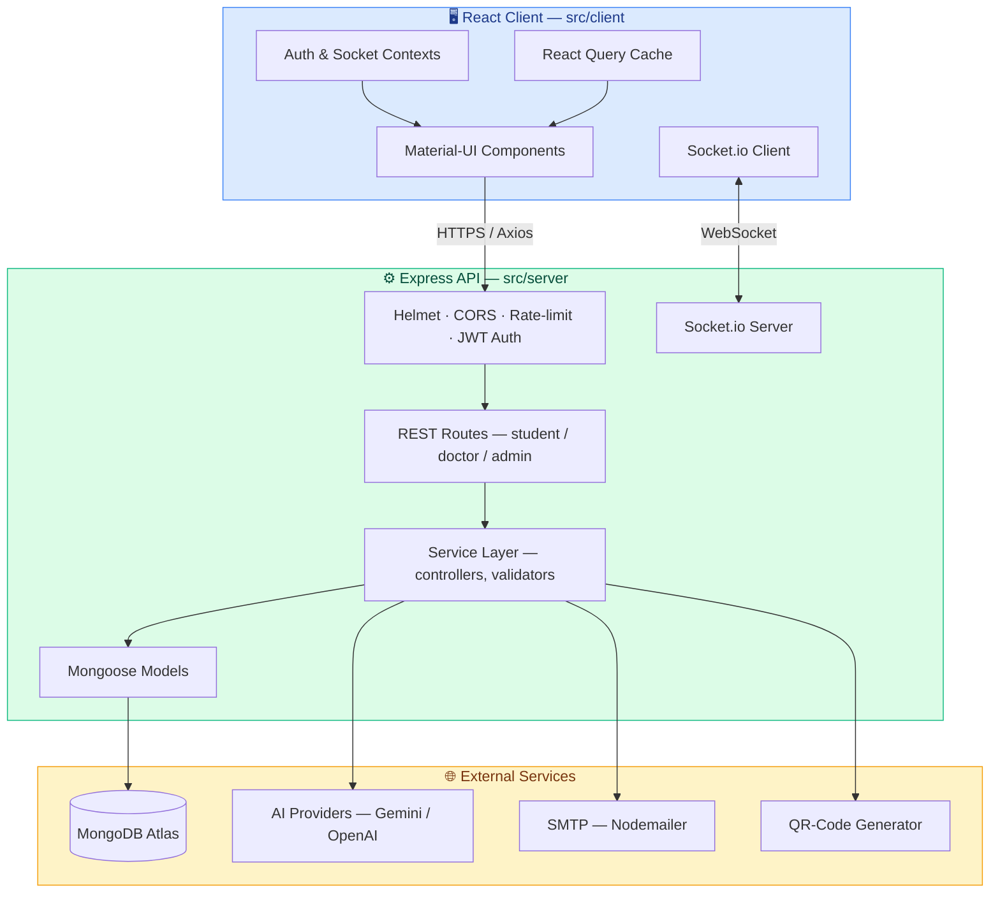

<div align="center">


# DormDoc

### **Reimagining campus healthcare for the digital age.**

*A unified, real-time platform that transforms the college dispensary from paper trails into a connected digital practice — for students, doctors, and administrators.*

<br />

[](https://github.com/mightbeanshuu/DormDoc/actions)
[](https://github.com/mightbeanshuu/DormDoc/releases)
[](LICENSE)
[](https://nodejs.org/)
[](https://github.com/mightbeanshuu/DormDoc/commits)
[](https://github.com/mightbeanshuu/DormDoc/issues)
[](CONTRIBUTING.md)
[](https://eslint.org/)

<br />

<a href="https://skillicons.dev">
  
</a>

<br /><br />

**[Live Demo](https://dormdoc.netlify.app)** · **[Documentation](docs/)** · **[Report a Bug](https://github.com/mightbeanshuu/DormDoc/issues/new?labels=bug)** · **[Request a Feature](https://github.com/mightbeanshuu/DormDoc/issues/new?labels=enhancement)**

</div>

---

## 📚 Table of Contents

<details>
<summary>Click to expand</summary>

- [Overview](#-overview)
- [Why DormDoc](#-why-dormdoc)
- [Key Features](#-key-features)
- [Tech Stack](#%EF%B8%8F-tech-stack)
- [System Architecture](#%EF%B8%8F-system-architecture)
- [Project Structure](#-project-structure)
- [Getting Started](#-getting-started)
- [Usage & API](#-usage--api)
- [Configuration](#%EF%B8%8F-configuration)
- [Testing](#-testing)
- [Deployment](#-deployment)
- [Roadmap](#%EF%B8%8F-roadmap)
- [Contributing](#-contributing)
- [Security](#-security)
- [License](#-license)
- [Acknowledgements](#-acknowledgements)

</details>

---

## 🔭 Overview

**DormDoc** is a full-stack, production-grade web application engineered to digitise every workflow inside a campus medical centre. From the moment a student scans a QR code at the counter to the moment an administrator audits monthly inventory, the entire patient journey lives inside a single, secure, real-time platform.

The system replaces fragmented paper records, manual queues, and siloed spreadsheets with a unified MERN-stack solution — purpose-built for the scale, reliability, and access-control requirements of an institutional healthcare environment.

> *"A campus clinic should run with the same precision as the hospitals its students may one day work in."*

---

## 💎 Why DormDoc

| Pain Point (Traditional Clinic) | DormDoc Solution |
| :--- | :--- |
| Paper prescriptions get lost | **Digital prescriptions** signed & retrievable anytime |
| Long queues at the dispensary | **QR-code check-in** + slot booking |
| No visibility into emergencies | **One-tap SOS** with live GPS dispatch |
| Inventory stockouts | **Threshold-based alerts** & auto-reorder reports |
| No data for decision-making | **Analytics dashboard** with trend visualisation |
| Manual leave verification | **Linked prescriptions** auto-validate leave requests |
| Disconnected ambulance dispatch | **Live fleet tracking** & queue management |

---

## ⚡ Key Features

<table>
<tr>
<td width="50%" valign="top">

### 👨‍🎓 For Students
- 🆔 **QR-code identity** — instant check-in at the counter
- 📅 **Smart appointment booking** with real-time slot availability
- 💊 **Digital prescriptions** accessible from any device
- 🚨 **Emergency SOS** with one-tap GPS dispatch
- 🤖 **AI medical chatbot** for symptom triage
- 📝 **Medical leave** auto-linked to prescriptions
- 📜 **Personal health history** in one place

</td>
<td width="50%" valign="top">

### 🩺 For Doctors
- 🗂️ **Patient queue management** with priority flags
- ✍️ **E-prescription writer** with drug-interaction hints
- 💬 **Real-time chat** with patients via Socket.io
- 📊 **Appointment dashboard** with daily/weekly views
- 📁 **Patient history lookup** across visits
- 🔔 **Live notifications** for new bookings & SOS

</td>
</tr>
<tr>
<td width="50%" valign="top">

### 🛠️ For Administrators
- 📈 **Analytics dashboard** — visits, demographics, trends
- 📦 **Inventory management** with reorder thresholds
- 🚑 **Ambulance fleet** dispatch & queue tracking
- ✅ **Leave-request approval** workflow
- 👥 **User & role management** (RBAC)
- 📤 **Exportable reports** (CSV / PDF)

</td>
<td width="50%" valign="top">

### 🔒 Platform-Wide
- 🔐 **JWT-based RBAC** — three distinct role spaces
- 🛡️ **Helmet, CORS, rate-limiting** baked in
- ⚡ **Socket.io real-time** layer for live UX
- 📱 **Fully responsive** — mobile-first design
- 🌐 **REST API** with input validation
- 🧪 **Health-check endpoints** for monitoring

</td>
</tr>
</table>

---

## 🛠️ Tech Stack

<div align="center">

| Layer | Technologies |
| :--- | :--- |
| **Frontend** | React 18 · Material-UI · React Query · React Router · Recharts · Socket.io-client |
| **Backend** | Node.js (≥18) · Express · Mongoose · Socket.io · JWT |
| **Database** | MongoDB 6.0+ |
| **Security** | Helmet · CORS · express-rate-limit · bcryptjs · express-validator |
| **Integrations** | Nodemailer (SMTP) · Google Gemini / OpenAI (chatbot) · QRCode |
| **Tooling** | ESLint · Husky · lint-staged · Nodemon · Concurrently |
| **CI / Deploy** | GitHub Actions · Netlify · Heroku-ready |

</div>

---

## 🏗️ System Architecture



### Request Lifecycle

1. **Client** issues an authenticated request bearing a JWT.
2. **Middleware stack** applies Helmet, CORS, rate-limiting, and token verification.
3. **Route handler** delegates to a controller, which validates inputs.
4. **Service layer** orchestrates business logic across Mongoose models.
5. **Database** persists the change; relevant events broadcast via Socket.io.
6. **Client** receives the HTTP response and any live updates simultaneously.

---

## 📁 Project Structure

```
DormDoc/
├── assets/                 # Static assets (logo, branding)
├── docs/                   # Extended documentation
├── scripts/                # Seed / migration scripts
├── src/
│   ├── client/             # React frontend
│   │   ├── public/
│   │   └── src/
│   │       ├── components/
│   │       ├── contexts/
│   │       ├── hooks/
│   │       ├── pages/
│   │       └── services/
│   └── server/             # Express backend
│       ├── config/
│       ├── controllers/
│       ├── middleware/
│       ├── models/
│       ├── routes/
│       ├── services/
│       ├── utils/
│       └── server.js
├── tests/                  # Unit & integration tests
├── .env.example
├── netlify.toml
└── package.json
```

---

## 🚀 Getting Started

### Prerequisites

| Dependency | Minimum | Notes |
| :--- | :---: | :--- |
| [Node.js](https://nodejs.org/) | **18.0** | LTS recommended |
| npm | **9.0** | Bundled with Node.js |
| [MongoDB](https://www.mongodb.com/try/download/community) | **6.0** | Local or Atlas |
| Git | **2.30** | — |

### Installation

```bash
# 1. Clone the repository
git clone https://github.com/mightbeanshuu/DormDoc.git
cd DormDoc

# 2. Install root + client dependencies
npm install
npm run install-client

# 3. Create your environment file
cp .env.example .env
#    → fill in MONGODB_URI, JWT_SECRET, and any optional keys

# 4. (Optional) Seed the database with demo data
npm run seed

# 5. Launch the full stack in dev mode
npm run dev
```

The dev server boots:
- ⚛️  **React client** → http://localhost:3000
- 🔌 **Express API** → http://localhost:5000

---

## 💡 Usage & API

### Health check

```bash
curl http://localhost:5000/api/health
```

```json
{
  "status": "OK",
  "timestamp": "2026-05-21T00:00:00.000Z",
  "uptime": 123.456
}
```

### Book an appointment (student)

```bash
curl -X POST http://localhost:5000/api/student/appointments \
  -H "Authorization: Bearer <JWT_TOKEN>" \
  -H "Content-Type: application/json" \
  -d '{
    "doctorId": "64f1a2b3c4d5e6f7a8b9c0d1",
    "date": "2026-05-25",
    "timeSlot": "10:00 AM",
    "reason": "Routine check-up"
  }'
```

```json
{
  "message": "Appointment booked successfully",
  "appointment": {
    "_id": "64f1a2b3c4d5e6f7a8b9c0d2",
    "status": "scheduled",
    "date": "2026-05-25T00:00:00.000Z"
  }
}
```

### Trigger an emergency SOS

```bash
curl -X POST http://localhost:5000/api/student/sos \
  -H "Authorization: Bearer <JWT_TOKEN>" \
  -H "Content-Type: application/json" \
  -d '{ "lat": 23.4126, "lng": 85.4396, "note": "Severe chest pain" }'
```

A full route inventory lives in [`docs/api.md`](docs/api.md).

---

## ⚙️ Configuration

All runtime configuration is driven by environment variables. Copy [`.env.example`](.env.example) to `.env` and customise.

| Variable | Required | Default | Purpose |
| :--- | :---: | :--- | :--- |
| `NODE_ENV` |  | `development` | Runtime environment |
| `PORT` |  | `5000` | Express server port |
| `MONGODB_URI` | ✅ | `mongodb://localhost:27017/dormdoc` | MongoDB connection URI |
| `JWT_SECRET` | ✅ | — | JWT signing secret |
| `JWT_EXPIRE` |  | `7d` | Token lifetime |
| `CLIENT_URL` |  | `http://localhost:3000` | Allowed CORS origin |
| `GOOGLE_AI_API_KEY` |  | — | Gemini API key (chatbot) |
| `OPENAI_API_KEY` |  | — | OpenAI API key (chatbot) |
| `EMAIL_HOST` |  | `smtp.gmail.com` | SMTP host |
| `EMAIL_PORT` |  | `587` | SMTP port |
| `EMAIL_USER` |  | — | SMTP username |
| `EMAIL_PASS` |  | — | SMTP password / app token |
| `QR_CODE_SECRET` |  | — | QR-code signing secret |
| `ERP_API_URL` |  | — | External ERP endpoint |
| `ERP_API_KEY` |  | — | External ERP key |

> ⚠️  **Never commit your `.env` file.** It is git-ignored by default.

---

## 🧪 Testing

```bash
# Run the full test suite
npm test

# Lint the entire codebase
npm run lint

# Format with Prettier (if configured)
npm run format
```

Test coverage reports are generated under `coverage/` and uploaded by CI on every push.

---

## 📦 Deployment

DormDoc ships with deployment recipes for multiple platforms:

| Platform | Status |
| :--- | :---: |
| **Netlify** (client) | ✅ Configured via `netlify.toml` |
| **Heroku** (full-stack) | ✅ `heroku-postbuild` hook |
| **Docker** | 🚧 Coming in v1.2 |
| **Kubernetes** | 🚧 On the roadmap |

For a production build:

```bash
npm run build && npm start
```

---

## 🗺️ Roadmap

- [x] Core MERN scaffolding & role-based authentication
- [x] Appointment booking, prescriptions, and SOS
- [x] Analytics dashboard & inventory module
- [x] AI chatbot integration (Gemini / OpenAI)
- [ ] Comprehensive unit + integration test coverage
- [ ] End-to-end test suite with Cypress / Playwright
- [ ] Telemedicine video consultations (WebRTC)
- [ ] Wearable & IoT health-device integration
- [ ] React Native mobile applications
- [ ] Predictive analytics & ML-driven triage
- [ ] Docker images + Kubernetes manifests
- [ ] Staging & production CI/CD pipelines

See the [open issues](https://github.com/mightbeanshuu/DormDoc/issues) for a live list.

---

## 🤝 Contributing

Contributions are what make open source thrive — every bug fix, feature, doc improvement, or suggestion is welcomed and appreciated.

1. **Fork** the project
2. **Create** your feature branch (`git checkout -b feat/amazing-feature`)
3. **Commit** your changes (`git commit -m 'feat: add amazing feature'`)
4. **Push** to your branch (`git push origin feat/amazing-feature`)
5. **Open** a Pull Request

Please review the [Contributing Guide](CONTRIBUTING.md) and [Code of Conduct](CODE_OF_CONDUCT.md) before opening a PR.

---

## 🛡️ Security

If you discover a security vulnerability, please **do not** open a public issue. Instead, follow the disclosure process outlined in [`SECURITY.md`](SECURITY.md). Reports are triaged within 48 hours.

---

## 📄 License

Distributed under the **MIT License**. See [`LICENSE`](LICENSE) for full text.

```
Copyright (c) 2026 DormDoc Contributors

Permission is hereby granted, free of charge, to any person obtaining a copy
of this software and associated documentation files (the "Software"), to deal
in the Software without restriction...
```

---

## 🙏 Acknowledgements

Standing on the shoulders of giants — sincere thanks to the maintainers of:

<div align="center">

[React](https://react.dev/) · [Express](https://expressjs.com/) · [MongoDB](https://www.mongodb.com/) · [Material-UI](https://mui.com/) · [Socket.io](https://socket.io/) · [Recharts](https://recharts.org/) · [Mongoose](https://mongoosejs.com/) · [JWT](https://jwt.io/) · [Helmet](https://helmetjs.github.io/)

And to every contributor, tester, and end-user whose feedback shaped this platform.

</div>

---

<div align="center">

### ⭐ If this project helped you, consider giving it a star — it keeps the lights on.

<sub>Built with ❤️  and a lot of coffee.</sub>

</div>
