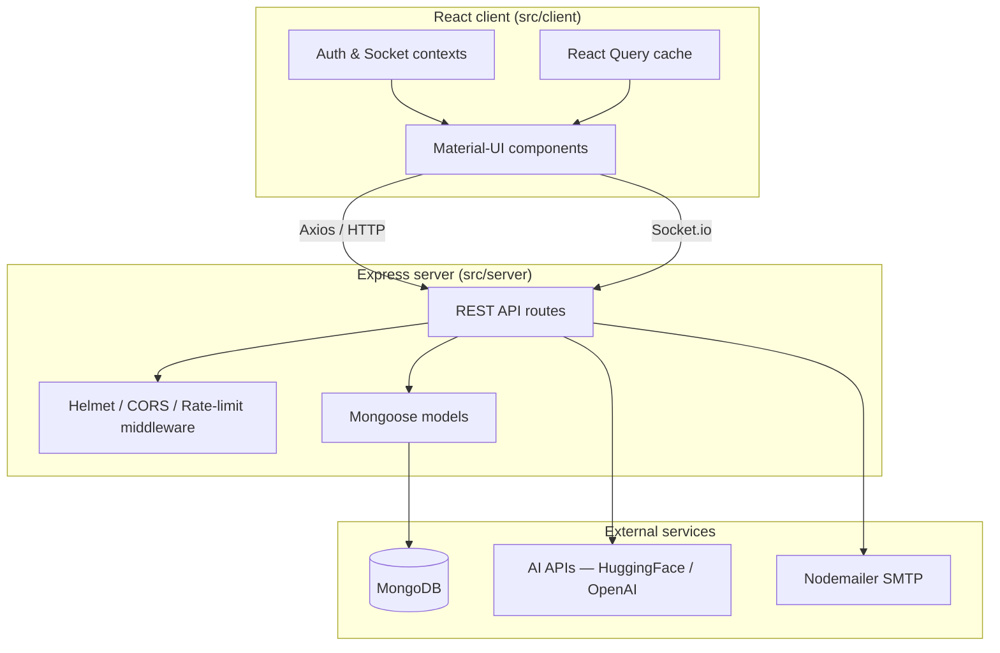

<p align="center">
  
</p>

# DormDoc

*A comprehensive college dispensary management system that digitises campus healthcare.*

<!-- Badges -->


<!-- Tech stack icons -->
<p align="center">
  <a href="https://skillicons.dev">
    
  </a>
</p>

---

## 📑 Table of contents

- [Overview](#-overview)
- [Features](#-features)
- [Architecture](#-architecture)
- [Getting started](#-getting-started)
- [Usage](#-usage)
- [Configuration](#-configuration)
- [Contributing](#-contributing)
- [Roadmap](#-roadmap)
- [License](#-license)
- [Acknowledgements & credits](#-acknowledgements--credits)

---

## 🔭 Overview

DormDoc is a full-stack web application purpose-built for the Birla Institute of Technology,
Mesra to modernise its campus dispensary. It replaces paper-based workflows with a digital
platform that connects students, doctors, and administrators through a single unified system.

Students can book appointments, receive digital prescriptions, trigger emergency SOS alerts,
and interact with an AI-powered medical chatbot — all from their browser or phone. Doctors
manage patient queues, write prescriptions, and communicate with patients in real time.
Administrators gain a bird's-eye view through an analytics dashboard, inventory tracking,
ambulance fleet management, and leave-request processing.

The project uses a modern MERN stack (MongoDB, Express, React, Node.js) with Material-UI
for a polished interface, Socket.io for real-time features, and JWT-based role-based access
control to enforce student / doctor / admin boundaries.

---

## ⚡ Features

- **QR-code identification** — Every student gets a unique QR code for instant check-in at
  the dispensary counter.
- **Appointment booking** — Students schedule visits with available doctors and receive
  real-time slot confirmations.
- **Digital prescriptions** — Doctors create, sign, and share prescriptions that students can
  access anywhere.
- **Emergency SOS** — One-tap emergency alerts with GPS coordinates dispatched to on-duty
  medical staff.
- **AI medical chatbot** — Rule-based local fallback plus optional Hugging Face / OpenAI /
  Cohere integration for intelligent triage.
- **Ambulance fleet management** — Admins track, dispatch, and queue ambulances across
  campus in real time.
- **Analytics dashboard** — Rich appointment trends, doctor performance, emergency stats, and
  department demographics visualised with Recharts.
- **Inventory management** — Track medical supplies, set reorder thresholds, and generate
  stock reports.
- **Leave application** — Students apply for medical leave backed by digital prescriptions;
  admins approve or reject inline.
- **Role-based access control** — JWT authentication with three distinct roles (student,
  doctor, admin), each with tailored dashboards.

---

## 🏗️ Architecture



---

## 🚀 Getting started

### Prerequisites

| Dependency | Min version | Install link |
|---|---|---|
| Node.js | 18.0 | [nodejs.org](https://nodejs.org/) |
| npm | 9.0 | Ships with Node.js |
| MongoDB | 6.0 | [mongodb.com/try/download](https://www.mongodb.com/try/download/community) |
| Git | 2.30 | [git-scm.com](https://git-scm.com/) |

### Installation

1. **Clone the repository**

   ```bash
   git clone https://github.com/mightbeanshuu/DormDoc.git
   cd DormDoc
   ```

2. **Install server dependencies**

   ```bash
   npm install
   ```

3. **Install client dependencies**

   ```bash
   npm run install-client
   ```

4. **Create your environment file**

   ```bash
   cp .env.example .env
   ```

   Open `.env` and fill in your MongoDB URI, JWT secret, and any optional API keys.

### Quick start

```bash
npm run dev
```

This starts both the Express API (port 5000) and the React dev server (port 3000)
concurrently. Open [http://localhost:3000](http://localhost:3000) in your browser.

---

## 💡 Usage

### Booking an appointment (student)

```bash
# After logging in as a student, call the REST API directly:
curl -X POST http://localhost:5000/api/student/appointments \
  -H "Authorization: Bearer <JWT_TOKEN>" \
  -H "Content-Type: application/json" \
  -d '{
    "doctorId": "64f1a2b3c4d5e6f7a8b9c0d1",
    "date": "2026-05-10",
    "timeSlot": "10:00 AM",
    "reason": "Routine check-up"
  }'
```

Expected response:

```json
{
  "message": "Appointment booked successfully",
  "appointment": {
    "_id": "64f1a2b3c4d5e6f7a8b9c0d2",
    "status": "scheduled",
    "date": "2026-05-10T00:00:00.000Z"
  }
}
```

### Checking system health

```bash
curl http://localhost:5000/api/health
```

Expected response:

```json
{
  "status": "OK",
  "timestamp": "2026-05-07T00:00:00.000Z",
  "uptime": 123.456
}
```

---

## ⚙️ Configuration

| Variable | Default | Required | Description |
|---|---|---|---|
| `NODE_ENV` | `development` | No | App environment (`development` / `production`) |
| `PORT` | `5000` | No | Express server port |
| `MONGODB_URI` | `mongodb://localhost:27017/college-dispensary` | **Yes** | MongoDB connection string |
| `JWT_SECRET` | — | **Yes** | Secret key for signing JSON Web Tokens |
| `JWT_EXPIRE` | `7d` | No | Token expiry duration |
| `CLIENT_URL` | `http://localhost:3000` | No | Allowed CORS origin for the React client |
| `GOOGLE_AI_API_KEY` | — | No | Google AI (Gemini) API key for chatbot |
| `OPENAI_API_KEY` | — | No | OpenAI API key for chatbot |
| `EMAIL_HOST` | `smtp.gmail.com` | No | SMTP host for outbound emails |
| `EMAIL_PORT` | `587` | No | SMTP port |
| `EMAIL_USER` | — | No | SMTP username |
| `EMAIL_PASS` | — | No | SMTP password / app password |
| `QR_CODE_SECRET` | — | No | Secret for QR code generation |
| `ERP_API_URL` | — | No | External ERP system endpoint |
| `ERP_API_KEY` | — | No | ERP API key |

See [`.env.example`](.env.example) for a ready-to-copy template.

---

## 🤝 Contributing

We welcome contributions of all kinds — bug fixes, new features, documentation improvements,
and more. Please read our [Contributing guide](CONTRIBUTING.md) for details on the fork →
branch → commit → PR workflow, code style expectations, and how to run tests locally.

---

## 🗺️ Roadmap

- [ ] Add unit and integration test suites for server routes
- [ ] Add end-to-end tests with Cypress for the React client
- [ ] Implement telemedicine video consultations
- [ ] Add wearable / IoT health-device integration
- [ ] Build native mobile apps (React Native)
- [ ] Introduce predictive analytics with ML models
- [ ] Containerise with Docker and add Kubernetes manifests
- [ ] Set up staging and production CI/CD pipelines

---

## 📄 License

Distributed under the **MIT License**. See [`LICENSE`](LICENSE) for details.

---

## 🙏 Acknowledgements & credits

- [React](https://react.dev/) — UI framework
- [Express](https://expressjs.com/) — Backend framework
- [MongoDB](https://www.mongodb.com/) — Database
- [Material-UI](https://mui.com/) — Component library
- [Socket.io](https://socket.io/) — Real-time communication
- [Recharts](https://recharts.org/) — Charting library
- [Clerk](https://clerk.com/) — Authentication provider
- **BIT Mesra Administration** — For supporting the initiative
- **Medical staff** — For providing domain expertise
- **Student contributors** — For feedback and testing
